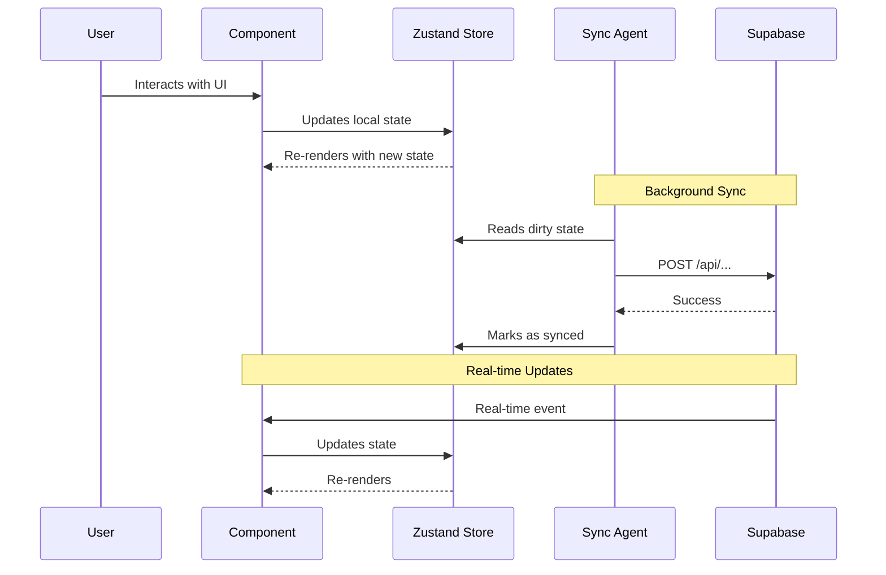

# Frontiers Architecture

This document provides a detailed overview of the frontiers application architecture, directory structure, and key design decisions.

## Application Structure

Frontiers is built using Next.js 15 App Router with a focus on modularity and maintainability through workspace packages.

### Technology Decisions

- **Next.js 15**: Chosen for its App Router, server components, and built-in optimizations
- **TypeScript (Strict Mode)**: Ensures type safety across the codebase
- **Supabase**: Provides authentication, database, and real-time subscriptions in one platform
- **Zustand**: Lightweight state management for client-side state
- **Jest + Playwright**: Comprehensive testing strategy covering unit and E2E tests

## Directory Organization

### Current Structure

```
apps/frontiers/
├── app/                    # Next.js App Router directory
│   ├── api/               # API route handlers (24 routes)
│   ├── auth/              # Authentication pages  
│   ├── fleet/             # Fleet management UI
│   ├── ledger/            # Transaction ledger
│   ├── profile/           # User profiles
│   ├── seasons/           # Seasonal content
│   ├── layout.tsx         # Root layout with providers
│   └── page.tsx           # Home page (map view)
│
├── components/            # React components (flat structure)
│   ├── AuthModalGate.tsx      # Authentication modal controller
│   ├── NavbarGate.tsx          # Conditional navbar renderer
│   ├── ResonanceRealtime.tsx  # Real-time resonance handler
│   ├── MissionsSyncAgent.tsx  # Background mission sync
│   ├── ProfileSyncAgent.tsx   # Background profile sync
│   ├── FullScreenMap.tsx       # Main map component
│   ├── auth/                   # Auth-related components (5 files)
│   ├── fleet/                  # Fleet management (16 files)
│   ├── map/                    # Map-related UI (12 files)
│   ├── HUD/                    # Heads-up display
│   ├── puzzles/                # Game puzzles
│   └── __tests__/              # Component tests
│
├── hooks/                 # Custom React hooks (16 hooks)
│   ├── useAuth.ts             # Authentication hook
│   ├── useShip.ts             # Ship data management
│   └── ...
│
├── lib/                   # Utility functions and helpers
│   ├── supabaseClient.ts      # Client-side Supabase instance
│   ├── supabaseAdmin.ts       # Server-side Supabase instance
│   ├── format.ts              # Formatting utilities
│   ├── crewScore.ts           # Crew scoring algorithm
│   ├── resonance.ts           # Resonance calculations
│   ├── map/                   # Map utilities (3 files)
│   └── __tests__/             # Unit tests
│
├── schemas/               # Zod schemas & TypeScript types (14 schemas)
│   ├── crew.ts
│   ├── ship.ts
│   └── ...
│
├── store/                 # Zustand stores (10 stores)
│   ├── useProfileStore.ts
│   ├── useShipStore.ts
│   ├── useMissionsStore.ts
│   └── ...
│
├── tests/                 # Test configuration
│   ├── setup.ts               # Jest setup file
│   └── utils/
│       └── test-utils.tsx     # Custom render helpers
│
├── e2e/                   # Playwright E2E tests
│   └── auth.spec.ts
│
└── supabase/              # Supabase configuration
    └── types.ts               # Generated database types
```

### Component Organization Rationale

**Current Approach**: Flat `components/` directory with sub-directories for specific features

**Pros**:
- Simple and easy to navigate for small-to-medium codebases
- Clear separation between feature-specific components (auth, fleet, map)
- Top-level components are highly visible

**Considerations for Future Growth**:
As the app grows, consider migrating to a feature-based structure:

```
components/
├── features/
│   ├── fleet/
│   │   ├── components/
│   │   ├── hooks/
│   │   └── utils/
│   ├── map/
│   │   ├── components/
│   │   ├── hooks/
│   │   └── utils/
│   └── resonance/
│       ├── components/
│       ├── hooks/
│       └── utils/
├── shared/               # Shared/common components
└── gates/                # Gate components
```

**When to migrate**: When individual features have >10 related components, or when cross-feature dependencies become complex.

## Core Patterns

### Gate Components

Gate components control UI visibility based on application state:

- **AuthModalGate**: Shows authentication modal for unauthenticated users
  - Prevents interaction with locked modal
  - Supports signin, signup, and password reset flows
  - Hidden on `/auth/*` routes to prevent double-modals

- **NavbarGate**: Conditionally renders the navigation bar
  - Hidden on home route (`/`) for immersive map experience
  - Shown on all other routes

**Pattern Benefits**:
- Centralized control logic
- Declarative UI state management
- Easy to test in isolation

### Sync Agents

Background components that handle data synchronization:

- **ProfileSyncAgent**: Keeps user profile data synchronized
- **MissionsSyncAgent**: 
  - Syncs mission progress every 10 minutes
  - Syncs on `beforeunload` to capture final state
  - Uses optimistic updates with eventual consistency

**Pattern Benefits**:
- Separation of sync logic from UI components
- Consistent sync timing across the app
- Graceful handling of network failures

### Real-time Components

Components that manage Supabase real-time subscriptions:

- **ResonanceRealtime**:
  - Subscribes to `resonance_effects` table for incoming resonance
  - Implements 5-minute polling fallback for reliability
  - Tracks seen notifications to prevent duplicates
  - Applies resonance effects to ship state

**Pattern Benefits**:
- Isolated subscription management
- Built-in fallback mechanisms
- Clean separation from UI rendering logic

## Data Flow



## State Management

### Zustand Stores

- **useProfileStore**: User profile data
- **useShipStore**: Current ship state, crew, fatigue
- **useMissionsStore**: Mission progress with sync tracking
- **useNotifStore**: Notification state and seen IDs

**Store Design Principles**:
- Keep stores focused on specific domains
- Use selectors to minimize re-renders
- Implement optimistic updates for better UX
- Track sync state for background persistence

## API Routes

Located in `app/api/`, organized by feature:

- `/api/campaigns/*`: Mission and campaign management
- `/api/payments/*`: Payment processing
- `/api/fleet/*`: Ship and crew operations
- `/api/resonance/*`: Resonance effect handling

**API Design**:
- Server-side Supabase client for database operations
- Validation using Zod schemas
- Error handling with appropriate status codes

## CI/CD & Deployment

### Vercel Deployment

- **Platform**: Vercel (optimized for Next.js)
- **Build Command**: `next build` (automatically detected)
- **Output Directory**: `.next`
- **Install Command**: Handled by monorepo root `pnpm install`

### Environment Variables in Vercel

All environment variables from `.env.example` must be configured in Vercel:

1. Go to Project Settings → Environment Variables
2. Add each variable for Production, Preview, and Development environments
3. **Critical**: `SUPABASE_SERVICE_ROLE_KEY` should ONLY be set for Production and Preview (server-side only)

### Build Optimization

- Next.js automatic code splitting
- Turbopack for fast development builds
- Static optimization for non-dynamic pages

## Testing Strategy

### Unit Tests (Jest)

- **Target**: Utility functions, hooks, isolated component logic
- **Location**: `__tests__/` directories alongside source code
- **Coverage Goal**: >50% for critical paths

### Component Tests (Jest + RTL)

- **Target**: Component rendering, user interactions, edge cases
- **Approach**: Test behavior, not implementation details
- **Mocking**: Supabase client, Next.js navigation

### E2E Tests (Playwright)

- **Target**: Critical user flows (auth, fleet management, mission completion)
- **Location**: `e2e/` directory
- **Browsers**: Chromium, Firefox, WebKit

## Performance Considerations

### Map Optimization

- Lazy load Leaflet library
- Virtualize large marker collections
- Debounce pan/zoom events

### Real-time Subscriptions

- Single channel per user for resonance
- Automatic cleanup on unmount
- Polling fallback to handle connection issues

### State Updates

- Batched updates in Zustand stores
- Selective re-renders using zustand selectors
- Optimistic UI updates for better perceived performance

## Security

### Authentication

- Supabsase Auth handles all authentication flows
- Row-level security (RLS) policies in database
- Service role key never exposed to client

### API Protection

- Internal API routes validate authentication
- CORS configured for known origins
- Rate limiting (future consideration)

## Future Considerations

### Scalability

- Consider edge caching for static assets
- Implement request deduplication for high-traffic APIs
- Add Redis for session management if needed

### Feature Organization

- Migrate to feature-based directory structure when appropriate
- Consider code splitting by route for larger bundles
- Evaluate need for mono-repo build optimization

### Monitoring

- Add error tracking (e.g., Sentry)
- Implement analytics for user behavior
- Monitor API response times and database query performance
